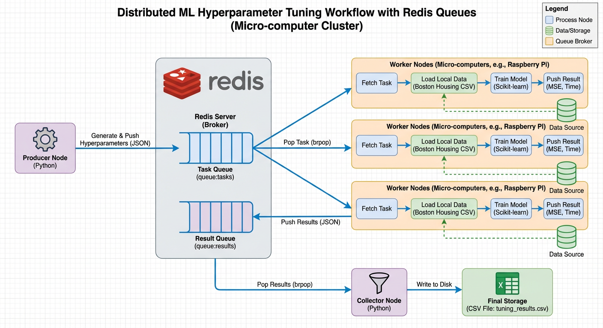

# Distributed ML on Redis & Raspberry Pi

一个基于 Redis 的轻量级分布式机器学习训练框架，专为树莓派（Raspberry Pi）等微型计算机集群设计。

## 📖 项目简介

本项目旨在利用低功耗嵌入式设备构建计算集群，对机器学习模型（以波士顿房价预测为例）进行分布式超参数调优。

**核心特性：**
*   **轻量化**：移除 Celery 等重型依赖，仅使用 `redis-py` 实现原生任务队列。
*   **内存安全**：针对 1GB-4GB 内存环境优化，数据本地化，仅传输参数配置。
*   **易扩展**：Worker 节点即插即用，支持动态水平扩容。

---

## 🏗 系统架构

### 1. 工作流 (Workflow)
Producer 下发任务 -> Redis 队列缓冲 -> Workers 并发计算 -> Collector 实时落盘。


---

## 📂 项目结构

```text
dist-ml-redis-cluster/
├── configs/
│   └── settings.py       # Redis IP、端口及内存阈值配置
├── core/
│   ├── redis_client.py   # Redis 连接池管理
│   ├── data_loader.py    # 数据集加载 (内存常驻)
│   └── model_trainer.py  # 训练与评估逻辑 (可替换为任意模型)
├── roles/
│   ├── producer.py       # [发布者] 生成超参数网格并推送到队列
│   ├── worker.py         # [消费者] 从队列抢任务并计算 (部署于树莓派)
│   └── collector.py      # [收集者] 监听结果队列并写入 CSV
├── results/              # 存放输出结果
├── requirements.txt      # 依赖列表
└── README.md
